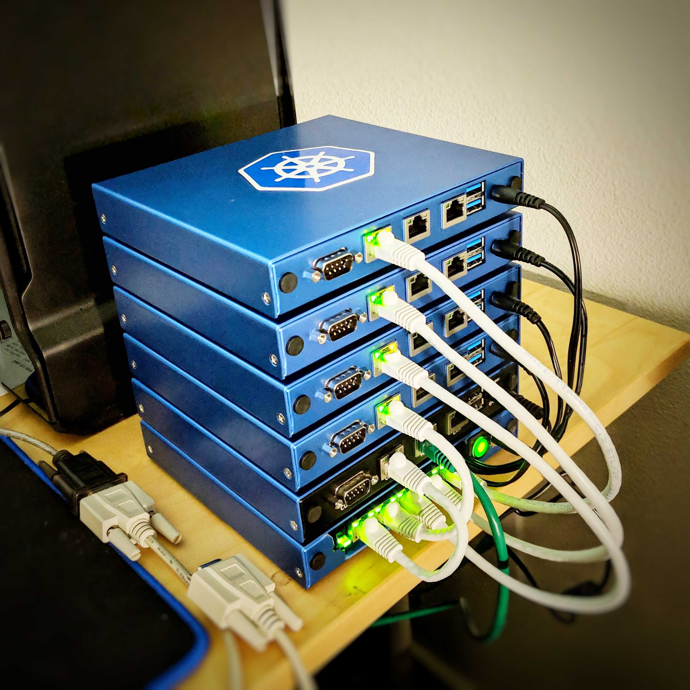

# The Kube

I want a Kubernetes cluster on low-power, low cost hardware that's
reasonably performant. The PCEngines APU2 fits the bill. I had some
laying around. 

This repo is by no means a best practice, good practice, or in any way
meant to be production-grade. This is a hacked-up repo full of tinkered
things.

Really, the only thing the APUs need is a serial cable and one kernel
flag to make sure the serial console gets setup.

This repo is called `The Kube` because I stacked all of the nodes. Their
aluminum cases made a rough rectangular prism that's close enough to a
cube that, in my opinion, warrants the pun.

## Prerequisites
- 4+ APU1/2 boards from PCEngines (or, really any computer with a serial
	console)
- SD cards installed in each APU. Any size > 8 GB will do. Docker images
	will be stored on mSATA disk. Speaking of which...
- mSATA disks installed in each APU. If they're not 250GiB, youll need
	to edit `install.yaml` to reflect that.
- FreeBSD installation image on a USB stick
- network cables and any other hardware that pleases you
- an internet connection

## Node Allocation
- 1 Freebsd gateway/proxy/firewall Node
- 3+ CoreOS Container Linux Nodes

## Features
- Two-phase PXE install to put CoreOS Container Linux on local disk.
- Config transpilation and validation. Edit the yaml, get well-formed,
	validated JSON.
- LVM Thinpool on each node for playing around with local persistent
	volume claims and LVM provisioners in K8s
- dedicated volume for docker images, configs, and container
	filesystems.
- DHCP is the athority for hostnames, addresses and the like. This may
	not be a "feature" but until I write or pull in some fabric, and
	inventory system, this will do.	

## What I Did and You Can Too
1. setup freebsd on an APU
2. install dnsmasq, nginx, and haproxy on the freebsd box
3. configure dnsmasq, nginx, haproxy, pf, and the system with the
	 configuration files in the `freebsd` directory
4. update the mac addresses in `dnsmasq.conf` to reflect your hardware
5. create a user `core` for convenience and for a place to run `kubeadm`
	 from.
6. Replace the SSH keys in `install.yaml` with yours.
7. run `make deploy remote=root@freebsdhost:/usr/local/etc/pxe/`
8. enable iPXE on the coreos APUs
9. pxe boot the coreos APUs
10. wait about 10 minutes
11. Check that you can SSH into all of the nodes, use ssh agent
		forwarding and the `core` user.
12. On node `one` run:
		sudo kubeadm init --pod-network-cidr 10.1.0.0/16 --apiserver-cert-extra-sans one.kube.net
13. Run the printed join commands on nodes two, three, and the rest.
14. Copy the kube config out to `~core/.kube/config` on the freebsd
		host. Also: `chmod 0600 .kube/config`
15. Deploy flannel:
		`kubectl apply -f kube-flannel.yaml` (or use the URL)
16. In a minute or two, once the flannel daemonset is up on all of the
		nodes, `kubectl get nodes` should show 3+ nodes in the `Ready` state.
17. Deploy stuff. Have fun. Break things. Fix things. Change things.
 
## Stuff I Want To Do
- Write or find a load balancer that connects to the VXLAN and can
	dynamically exposes deployed services. I tried this with traefik but
	had issues getting the vxlan interface in FreeBSD to talk to the
	nodes.
- Use a VPN (wireguard) or SSH (autossh/mosh) to automatically keep up a
	reverse proxy to a public host over which SSH and deployed services
	are accessible.
- Get LVM provisioning working with k8s so I can play around with
	smoothing out running stateful services like databases completely
	automatically in K8s.
- Take advantage of the GPIO pins in each APU and make a robot that runs K8s.
- Improve the bootstrapping process so it's not 17 steps.
- Get feedback from folks so this gets cooler, simpler, and more
	awesome.
